## LIT1 User Space安装

### 编译部分

首先要安装papi，**如果在之前有编译过的，应该要将原来的删掉**。最保险的措施，就是安装好papi之后，再解压缩，肯定没有问题，否则可能出现`NUMA_NODES`有关的问题，当然，计算出现了`NUMA_NODES`的问题，稍后我们也可以解决。

```shell
sudo apt-get update
sudo apt-get install libpapi-dev
```

进入`ulocks/src/litl/`目录。

使用`make -C .`命令编译，因该

这些新生成的sh文件，应该就是编译的结果吧。


#### NAMA_NODES问题：

有些时候会出现NUMA_NODES有关的问题，比如说找不到这个符号，或者是除0异常.


那么很有可能是因为NUMA_NODES的设置问题。这是因为默认定义中，把NUMA_NODES定义成了空，可以在`include/htlockepfl.h`中，修改这个定义，如下：

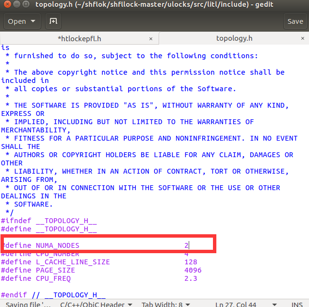

#### gettid问题


### 测试部分

根据readme中的信息，我们可以用`./xxxxxxx.sh myprogram`的方式运行生成的锁，


解下来，就可以测试锁啦，我从网上随便复制了一段锁测试代码。

```c++
#include <stdio.h>

#include <pthread.h>

pthread_mutex_t thread_mutex;

int global_val = 0;

void *thread1(void *arg){

while(1){

pthread_mutex_lock(&thread_mutex);

global_val = global_val + 1;

printf("thread1 global_val=%d\n", global_val);

global_val = global_val + 1;

usleep(100);

                printf("thread1 global_val=%d\n", global_val);

usleep(100);

pthread_mutex_unlock(&thread_mutex);

}

return NULL;

}

void *thread2(void *arg){

while(1){

pthread_mutex_lock(&thread_mutex);

        global_val = global_val + 1;

        printf("thread2 global_val=%d\n", global_val);

                usleep(100);

global_val = global_val + 1;

                printf("thread2 global_val=%d\n", global_val);

        usleep(100);

pthread_mutex_unlock(&thread_mutex);

}

return NULL;

}

int main(void){

pthread_t thread_id1 = 0, thread_id2 = 0;

pthread_mutex_init(&thread_mutex, NULL);

pthread_create(&thread_id1, NULL, thread1, NULL);

pthread_create(&thread_id2, NULL, thread2, NULL);

pthread_join(thread_id1, NULL);

pthread_join(thread_id2, NULL);

return 0;

}
```

在命令行中编译成可执行文件，然后再使用`./libxxxxx.sh myprogram`，我把上述代码保存在myprogram0.c中，命令如下:

```shell
gcc myprogram0.c -o myprogram0 -lpthread
./libcna_spinlock.sh ./myprogram0
```

然后就能看到满屏的输出了，代码测试成功！

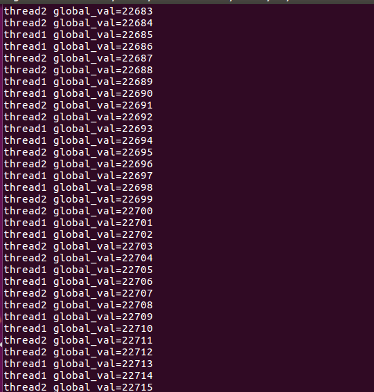

稍微修改一下代码，让他们不要无限输出。

```shell
#include <stdio.h>

#include <pthread.h>

pthread_mutex_t thread_mutex;

int global_val = 0;

void *thread1(void *arg){

while(global_val < 1000000){

pthread_mutex_lock(&thread_mutex);

global_val = global_val + 1;

printf("thread1 global_val=%d\n", global_val);

global_val = global_val + 1;


                printf("thread1 global_val=%d\n", global_val);


pthread_mutex_unlock(&thread_mutex);

}

return NULL;

}

void *thread2(void *arg){

while(global_val < 1000000){

pthread_mutex_lock(&thread_mutex);

        global_val = global_val + 1;

        printf("thread2 global_val=%d\n", global_val);


global_val = global_val + 1;

                printf("thread2 global_val=%d\n", global_val);


pthread_mutex_unlock(&thread_mutex);

}

return NULL;

}

int main(void){

pthread_t thread_id1 = 0, thread_id2 = 0;

pthread_mutex_init(&thread_mutex, NULL);

pthread_create(&thread_id1, NULL, thread1, NULL);

pthread_create(&thread_id2, NULL, thread2, NULL);

pthread_join(thread_id1, NULL);

pthread_join(thread_id2, NULL);

return 0;

}
```

重新编译一下

```shell
gcc myprogram0.c -o myprogram0 -lpthread
```

顺便记录一下运行时间,运行！

```shell
time ./libaqmwonode_spin_then_park.sh ./myprogram0
time ./libalockepfl_original.sh ./myprogram0
```


跑步比赛，现在开始!


比赛结束！


左边锁比右边锁快了2s多。再测试一下？


同样也相差了2s多，在这个测试中，左边锁完胜

**以下删除！！！！！！！**

**以下删除！！！！！！！**

**以下删除！！！！！！！**

**以下删除！！！！！！！**

------------------

## 使用论文中的程序测试锁

#### jemaloc安装

clone之后解压，进入`jemalloc-dev`中,根据文档的信息，可以通过./autogen.sh调用，因此，我们直接尝试使用`./autogen.sh`

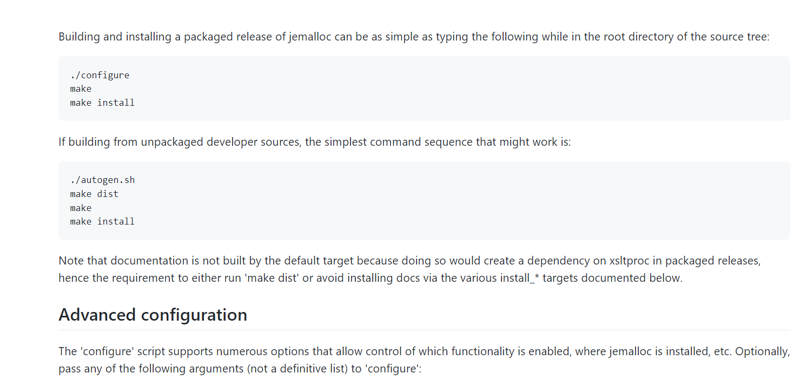

发现报错了，找不到autoconf这个包


autoconf是一个包，我们可以使用aptget安装

```shell
sudo apt-get install autoconf
```

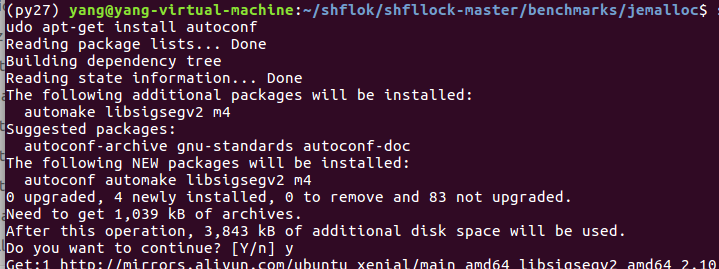

完成之后重复一下,就没有报错了，正常安装！

```shell
./autogen.sh
```


成功之后会输出一些安装信息

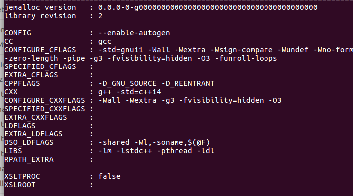

继续按照文档给出的安装方式.

```shell
make dist
make 
sudo make install
```

#### jemalloc自定义测试用例

安装完成之后，我们可以自己写一个测试程序，

测试jemalloc分配效率。

创建一个test0.c文件，内容如下：

```shell
#include <stdio.h>
#include <jemalloc/jemalloc.h>
#include <pthread.h>

#define MAX_TIMES 100000000


pthread_mutex_t thread_mutex;

int global_val = 0;
void *thread1(void *arg){

while(global_val < MAX_TIMES){

        malloc(10000000);


}

return NULL;

}

void *thread2(void *arg){

while(global_val < MAX_TIMES){

        malloc(10000000);


}

return NULL;

}


void *thread3(void *arg){

while(global_val < MAX_TIMES){
pthread_mutex_lock(&thread_mutex);


        global_val = global_val + 1;


pthread_mutex_unlock(&thread_mutex);
}

return NULL;

}

int main(void){

pthread_t thread_id1 = 0, thread_id2 = 0, thread_id3=0;

pthread_mutex_init(&thread_mutex, NULL);

pthread_create(&thread_id1, NULL, thread1, NULL);
pthread_create(&thread_id3, NULL, thread3, NULL);
pthread_create(&thread_id2, NULL, thread2, NULL);

pthread_join(thread_id1, NULL);
pthread_join(thread_id3, NULL);
pthread_join(thread_id2, NULL);


return 0;

}
```

调用gcc命令编译链接，并测试运行：

```shell
gcc test0.c -o jemallocTest -lpthread -ljemalloc # 编译生成
time ./jemallocTest #使用默认锁运行
time ./libclhepfl_original.sh ./jemallocTest #使用LITIL中clhepfl锁运行
```

效果如下：


在当前程序中，使用libclhepfl的效率比系统自带的锁慢3s。

#### jemalloc自带的测试用例

其实，在jemalloc中也有自带测试用例，我们也可以使用jemalloc项目文件中自带的项目进行测试。

---------------

**注意**：**shfllock的jemalloc是修过修改的的，需要自行到jemalloc的[github地址](https://github.com/jemalloc/jemalloc/wiki/Getting-Started)下clone过来，然后重复上述安装的过程。**


```shell
./autogen.sh
make dist
sudo make
sudo make install 
```

进入jemalloc的工程目录下，调用run_tests.sh了。

```shell
./run_tests.sh
```

发现报错了：


这里报错的是一个python脚本，而且是print方法使用错误，因为我的电脑默认环境是py3.7环境，print加冒号是py2.7的语法。这时候，一个合理的猜测就是应该要修改python环境。

这里我用anaconda管理环境，anaconda的安装可以看[另外一篇文档](https://github.com/DavidBeckham07/litl-Paper-Recurrent/blob/master/anaconda%E9%83%A8%E5%88%86%E6%96%87%E6%A1%A3.pdf)。

下面这个命令创建了一个python2.7环境，并且命名为py27

```shell
conda create -n py27 python=2.7
```

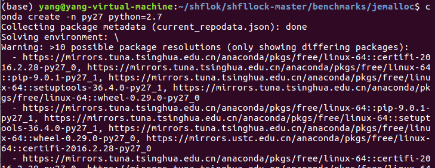

切换到py27环境，然后再次调用刚刚那个脚本run_tests.sh。

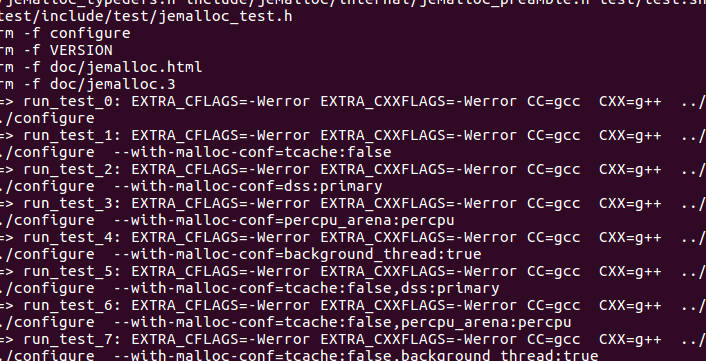

还是报错了


在run_test.out中，发现是一个expected变量声明了，没有使用，加上`cc1plus: warnings being treated as errors`,把warning当作error。因此报错了。

对此，我查找资料，发现和-Werror这个编译选项有关系，所以，我直接更改gcc的编译选项。

首先看一下run_tests.sh做了什么：

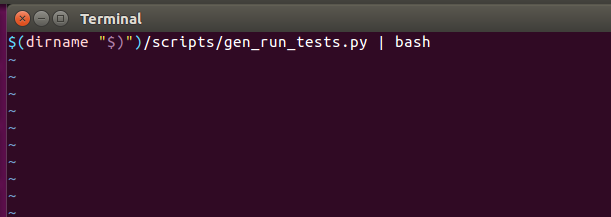

原来它间接调用了另外的脚本，打开scripts下的gen_run_tests.py文件，找到config_line这一行。

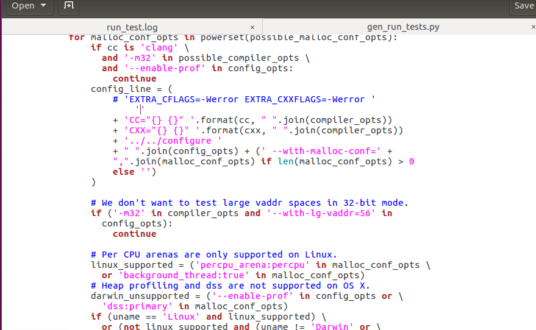

将原来的编译选项注释掉，改成空白字符。

```shell
                config_line = (
                    # 'EXTRA_CFLAGS=-Werror EXTRA_CXXFLAGS=-Werror '
			''
                    + 'CC="{} {}" '.format(cc, " ".join(compiler_opts))
                    + 'CXX="{} {}" '.format(cxx, " ".join(compiler_opts))
                    + '../../configure '
                    + " ".join(config_opts) + (' --with-malloc-conf=' +
                    ",".join(malloc_conf_opts) if len(malloc_conf_opts) > 0
                    else '')
```

再次运行，不报错啦。

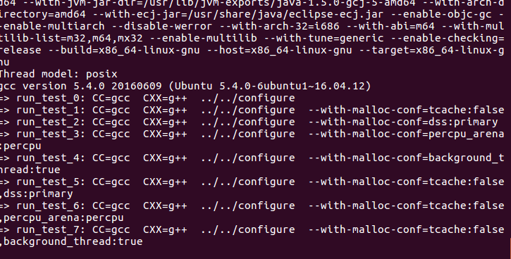

先慢慢等结果是可以跑出来的，但是要怎么使用LITL的锁呢，我的思路是将可执行文件生成之后单独拿出来测试。

为了拿到我们想要的可执行文件，我们需要做一点处理：

在sricpts目录下的gen_run_tests.py文件中，注释掉check 和 disclean两行句话。因为check命令会测试生成的文件、distclean命令会将生成的文件全部删除；而下面的print本来会运行多个sh脚本，我们这里简单修改，让他只运行一个`run_test_2/sh`。

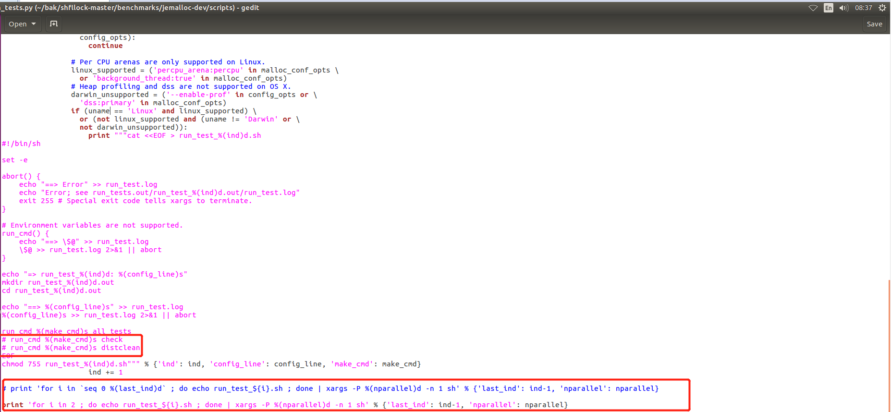

接着，重新回到上一层目录，调用`sudo ./run_tests.py`，记得要切换到py2.7环境下，如下：

```shell
conda activate py27
sudo ./run.run_tests.py
```

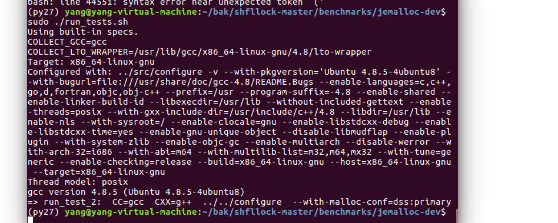

调用完成之后，进入`run_tests.out/run_test_2.out/test/stress`,在这里可以看到生成的可执行文件。


我们可以尝试运行一个，在当前目录下，命令行输入`./large_microbench`

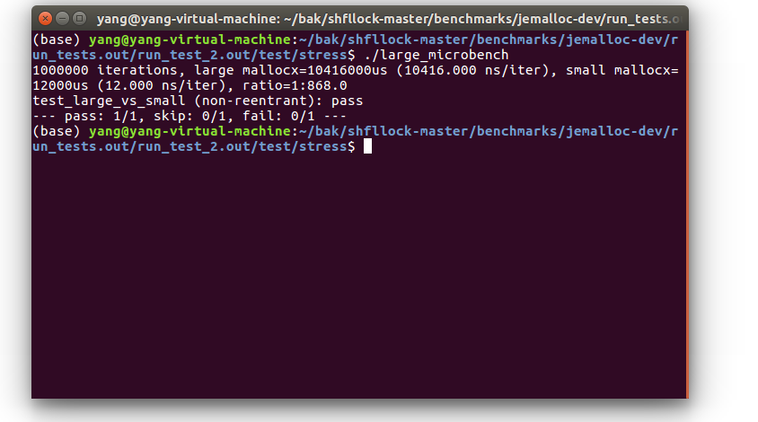


有了可执行文件，我们要怎么测试锁呢，一种方法是把可执行文件拷贝到litl目录下，然后在litil的目录下调用

```shell
./libalockepfl_original.sh ./large_microbench 
```


如图，第一行就证明了我们成功测试了LITL中的锁，现在我们要测试LITL中的锁和linux自带的锁性能差距，可以使用time命令，分别调用

```shell
time ./libalockepfl_original.sh ./large_microbench  # 使用LITL中lockepfl锁的时间
time ./large_microbench
```

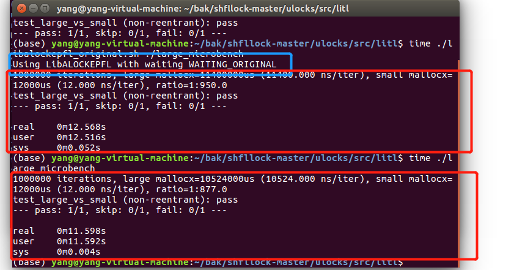

从上图中可以看出，在这个测试用例中，Linux自带的锁速度要快1s左右。

如果不想拷贝，可以直接在test/stress目录下，使用锁执行文件的全路径，原理和效果其实都是一样，我们测试可以使用下面一种方法。

```shell
time /home/yang/bak/shfllock-master/ulocks/s
rc/litl/libalockepfl_original.sh ./large_microbench
# 把全路径名改成你的对应位置。
```


这里同样也可以验证，在这个测试用例中，linux自带的锁要快1s左右。

