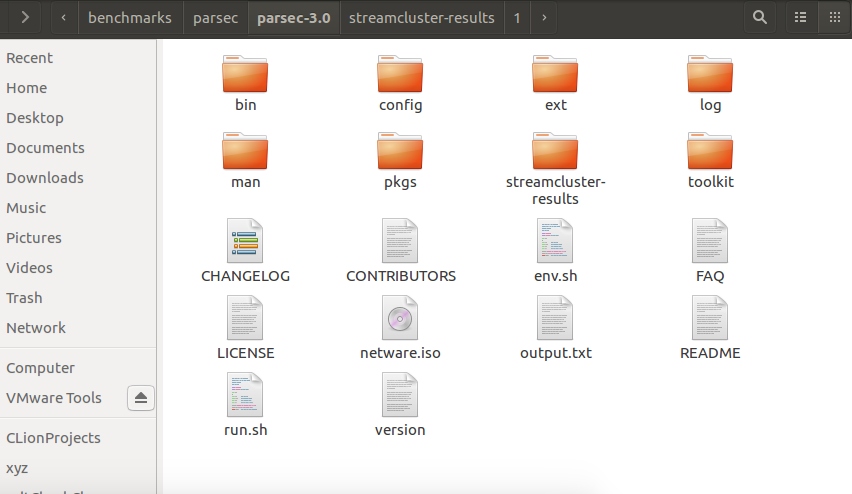
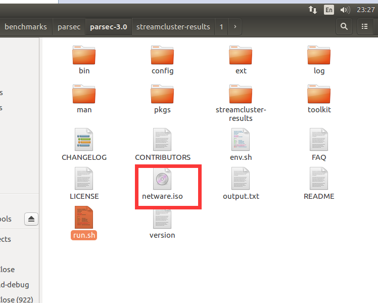
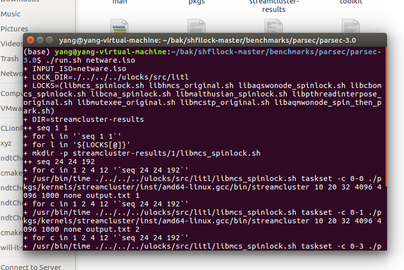
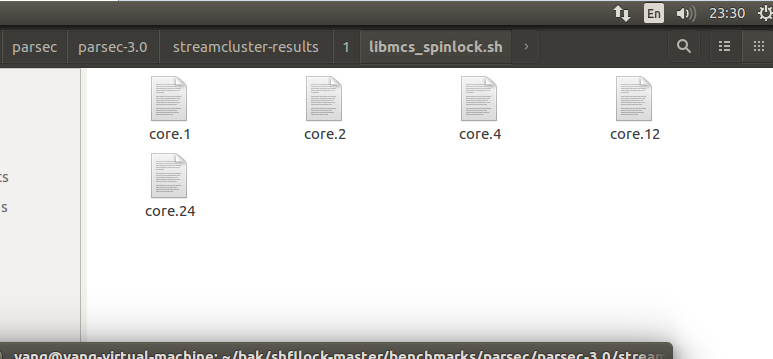
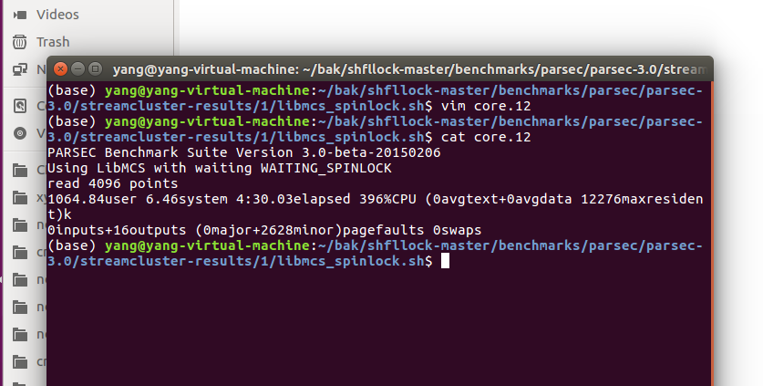
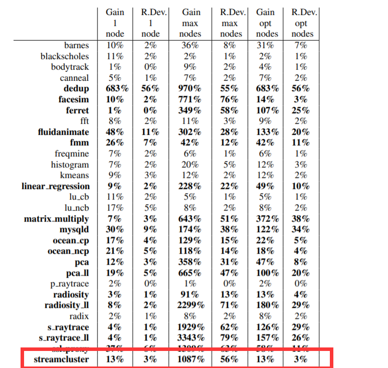
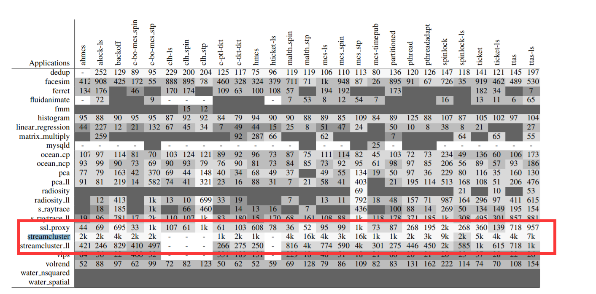
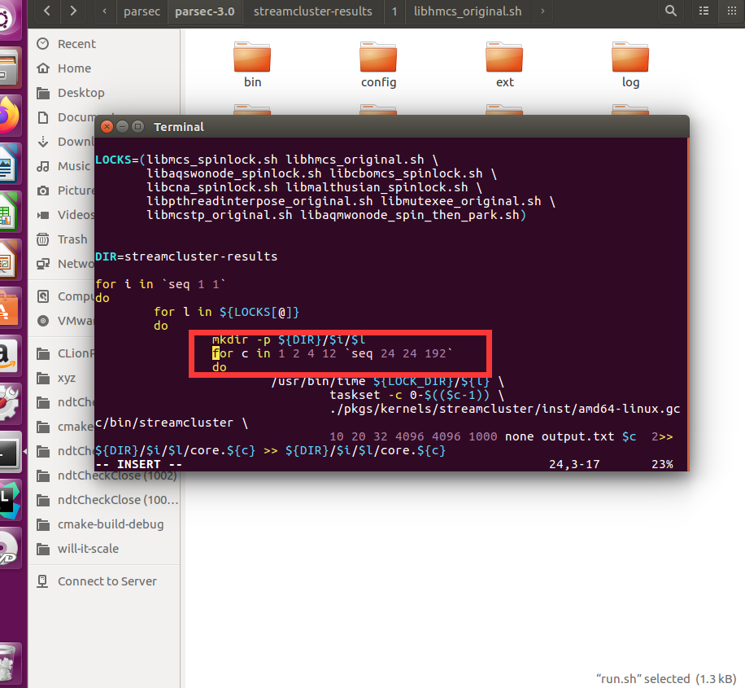

## 使用StreamCluster程序测试锁

### 构建parsec-3.0/streamCluster

参考[网站](https://parsec.cs.princeton.edu/parsec3-doc.htm)上的文档，到[这个网页](http://parsec.cs.princeton.edu/download/3.0/parsec-3.0-core.tar.gz)下载core文档，也可以直接在[这个Github地址上](https://github.com/DavidBeckham07/litl-materials.git)下载。

将`parsec-3.0-core.tar.gz`文件复制到`benchmards/parsec`目录下，再进行解压，进入解压后的文件，命令如下：

```shell
tar -xzf parsec-3.0.tar.gz
cd parsec-3.0
```

在`parsec`目录下，设置环境变量

```shell
source env.sh
```

构建`streamCluster`，命令如下：

```shell
parsecmgmt -a build -p streamcluster
```

### 使用streamcluster测试锁

将`parsec/run.sh`复制到`parsec/parsec-3.0`下。



修改`run.sh`中这个`LOCK_DIR`的值，必须是litl文件夹相对于当前run.sh的位置。这里，我们需要改成：

```shell
LOCK_DIR=./../../../ulocks/src/litl
```


保存退出之后将`测试iso`文件复制到`parsec-3.0`目录下，如图（测试iso文件是任意的iso文件，我这里用的已经上传[另外一个仓库](https://github.com/DavidBeckham07/litl-materials)）：



在当前目录下调用命令

```shell
./run.sh netware.iso
```



马上可以看到生成了streamcluster-results文件夹


里面就是各种锁测试的数据，比如说，`streamcluster-results/1/libmcs_spinlock.sh`目录下如下



分别记录了当前情况下运行所需要的时间：



#### 运行结果与论文比对

**记录的时间就可以和论文中StreamCluster这个用例进行比对。**论文中出现StreamCluster的主要是这两个地方，分别是对比核数对测试效率的影响，以及各种锁运行程序的时间对比，直接对应了`streamcluster-results`的结果。





#### 注意事项：

我跑的时候，发现核数到了48之后就跑得非常非常慢，这里我直接修改了run.sh，

```shell
for c in 1 2 4 12 `seq 24 24 192`
```

改成了

```shell
for c in 1 2 4 12 
```



重新运行即可。